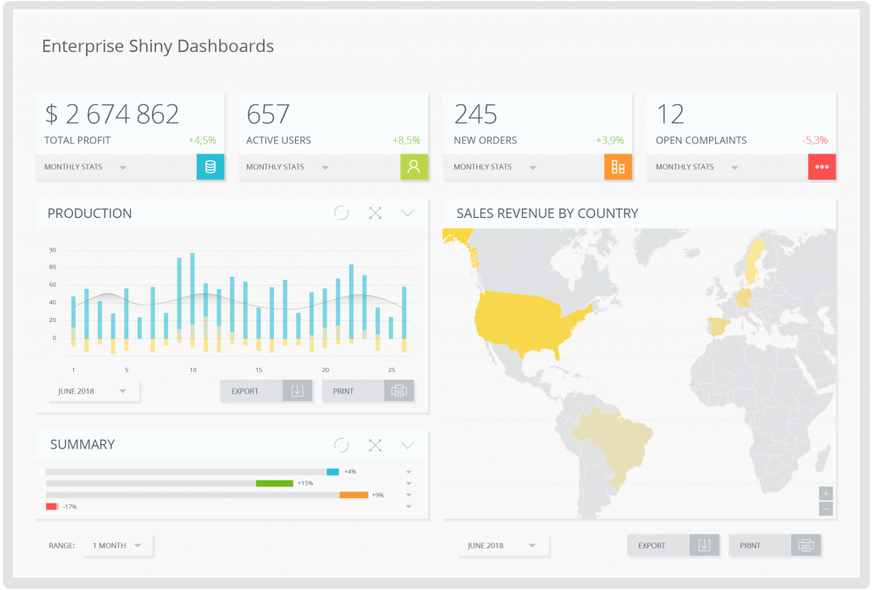

# Appsilon task recruitmant - Enterprise shiny dashboard

## Welcome! 👋

Thanks for chance and fun, when I made this project :)

To do this challenge, I need used a HTML, CSS and a tiny bit of JavaScript.

## The task

My challenge was to build out Enterprise shiny dashboard get it looking as close to the design as possible but I didn't have to implemented it exacly the same as in the mockup.

I decided to do this without frameworks. I used only pure HTML, CSS and JavaScript.

I assumed that:

- Codebase have good quality,
- View the optimal layout for the site depending on their device's screen size,
- See hover states for all interactive elements on the page,
- Dashboard had dark mode.

I made this project in desktop first way.

I tested this on:

- Safari 14.0,
- Firefox 81.0.2,
- Google Chrome 86.0.4240.111.

## Deploying your project

I decided to connect my project to GitHub and I used GitHub Pages.

Live: https://dczerniawko.github.io/sandbox/enterprise-shiny-dashboard-appsilon/
